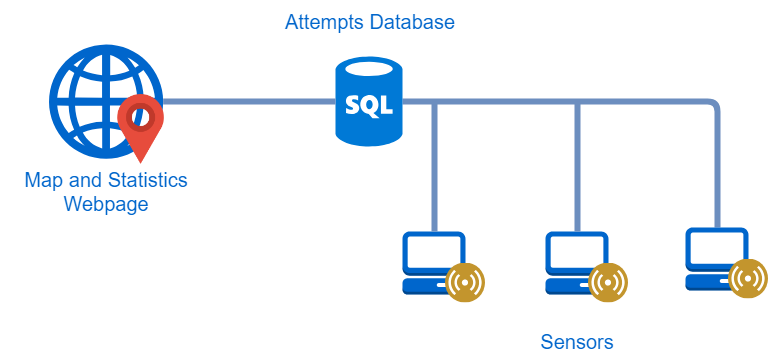

# Mapper-Server
Map and visualize SSH logins from sensors.

## Introduction

When I saw a huge amount of failed login attempts in my SSH logs, I wanted a way to get more information. I started out only mapping IPs using geolocation data and now the map is more interactive with links to Shodan and more statistics. This project is made up of a server and [sensor](https://github.com/becksteadn/Log-Sensor), both of which use the same SQL database. I also created a self-contained version [here](https://github.com/becksteadn/Log-Mapper) though it is not maintained.

The default log file is `auth.log` used for authentication, but any file with IP addresses can be used.



## Installation

### Clone the Repository

Download or clone the repo anywhere. `https://github.com/becksteadn/Mapper-Server.git`

### Using Docker

If you don't want to use Docker, skip to the Prerequisites section.

Once in the git repo, just run `docker-compose up` to start the MariaDB and Mapper Server containers. They will link and the map website will be available at `[docker-ip]:5000`.

### Prerequisites

Both the server and sensor require the MySQLdb connector.

Amazon Linux can use `sudo yum install mysql-devel python-devel MySQL-python`.

Debian systems can  install it with apt using `sudo apt-get install python-mysqldb`.


To install Python's dependencies run `pip install -r requirements.txt`.

### Database Configuration

Any SQL server will work. I use a MariaDB database using AWS's RDS service. Inside the `log_mapper` database the `attempts` table stores the IP and timestamp of all attempts. The `markers` table stores the unique IP addresses and whether it is starred or not. (Starring functionality coming soon.)

```
CREATE DATABASE log_mapper;
USE log_mapper;

CREATE TABLE attempts (
    id INT NOT NULL AUTO_INCREMENT,
    host VARCHAR(20) DEFAULT 'Anonymous',
    ip CHAR(15) NOT NULL,
    stamp DATETIME NOT NULL UNIQUE,
    success tinyint(4),
    PRIMARY KEY (id, stamp)
);

CREATE TABLE markers (
    ip CHAR(15) NOT NULL,
    starred tinyint(4),
    PRIMARY KEY (ip)
);
```

### Sensor Setup

You should now set up the [log sensor](https://github.com/becksteadn/Log-Sensor) to get attempts into the database.

### Server Configuration
All variables are in `server_vars.py`.

Enter database IP or hostname and login credentials. It's strongly recommended to make individual users for the server and sensor. The server should have SELECT and UPDATE permissions.

Add [Shodan](https://shodan.io) API key.

### Cron

This cron job will create the map files every hour. As the user with the Mapper-Server code, start the editor with `crontab -e`.

`0 * * * * cd ~/Mapper-Server && python draw_map.py`

### Daemon
Edit variables in `mapper-server` service file.

`sudo mv mapper-server /etc/init.d/`

`sudo service mapper-server start`
